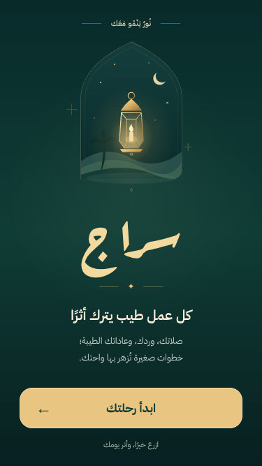
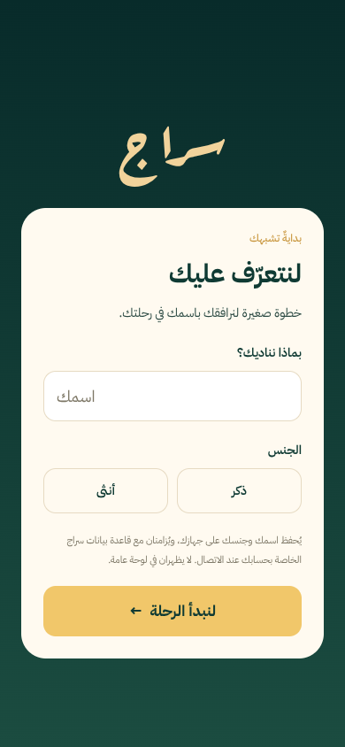
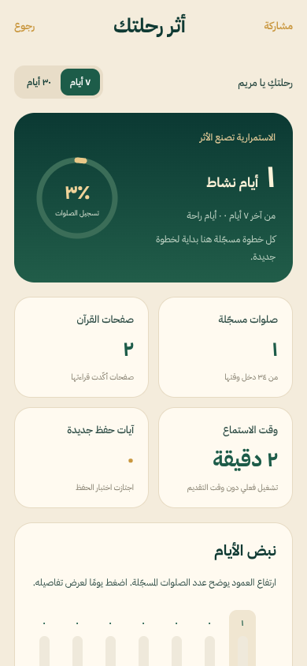
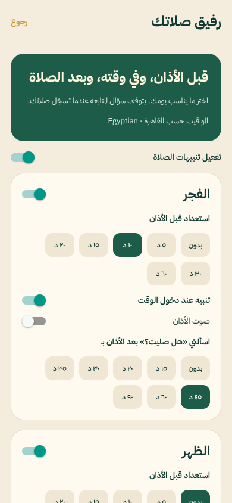
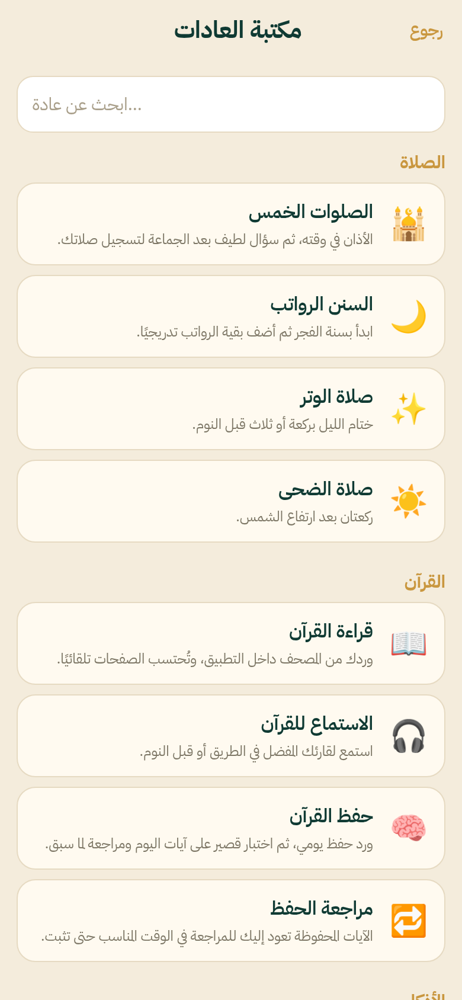
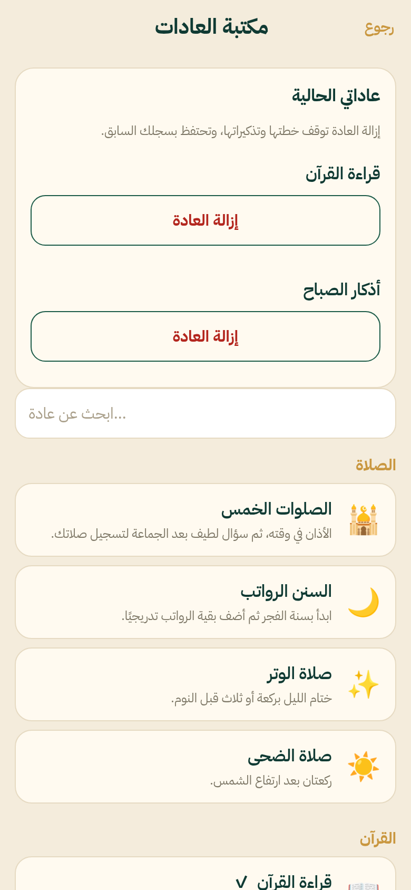
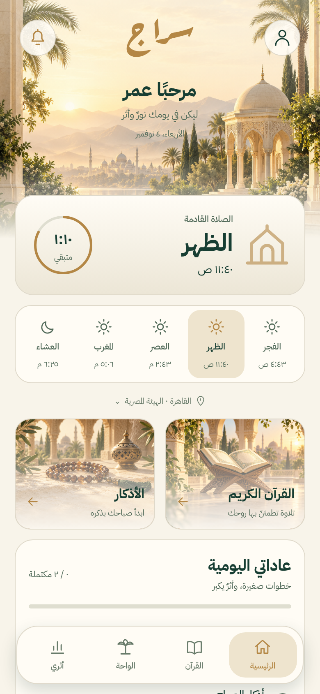
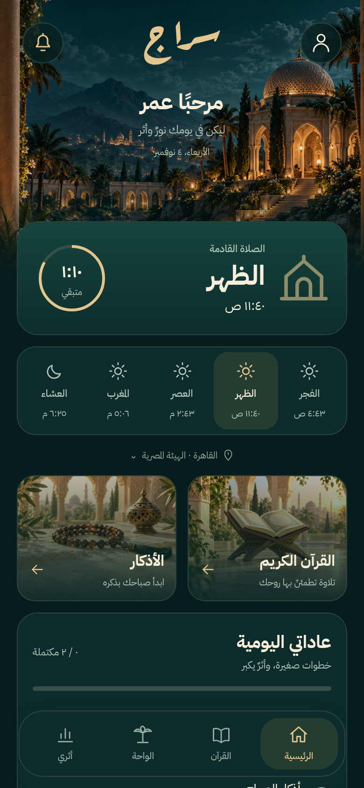

# Updated Sirag screens

Captured during browser checks at phone-sized viewports. The report uses sample data inserted only in an isolated browser test. Firebase requests were blocked during these checks; these screenshots do not show live cloud records. Native-device appearance and sound still require device testing.

## Arabic splash

## Personal profile

## Detailed reports

## Prayer reminder settings

## Habit library

Captured from the existing app's **Home → إضافة أو إدارة العادات** route at a 390 × 844 viewport, 2× pixel density. These are web previews, not installed Android screenshots. The management view uses two sample local plans in an isolated browser context; cloud requests were blocked. Both views loaded without JavaScript exceptions. No app behavior changed for these captures.

## Current homepage: light and dark

Captured from the current Home route at 390 × 844, 2× pixel density, with the guide dismissed and no activity recorded. The name and two habit plans are local browser fixtures; the clock is fixed to 4 November 2026, 10:30 in Cairo. Both themes loaded without JavaScript exceptions and cloud requests were blocked. These are web previews, not installed-device screenshots; no app behavior changed.

